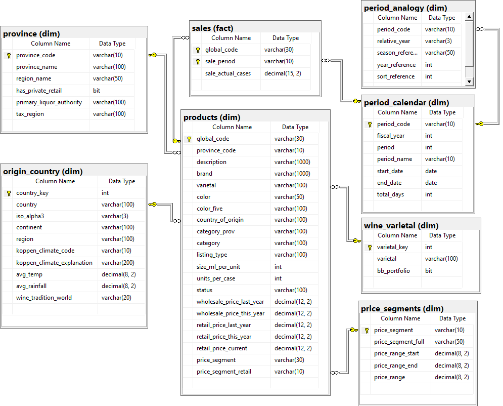
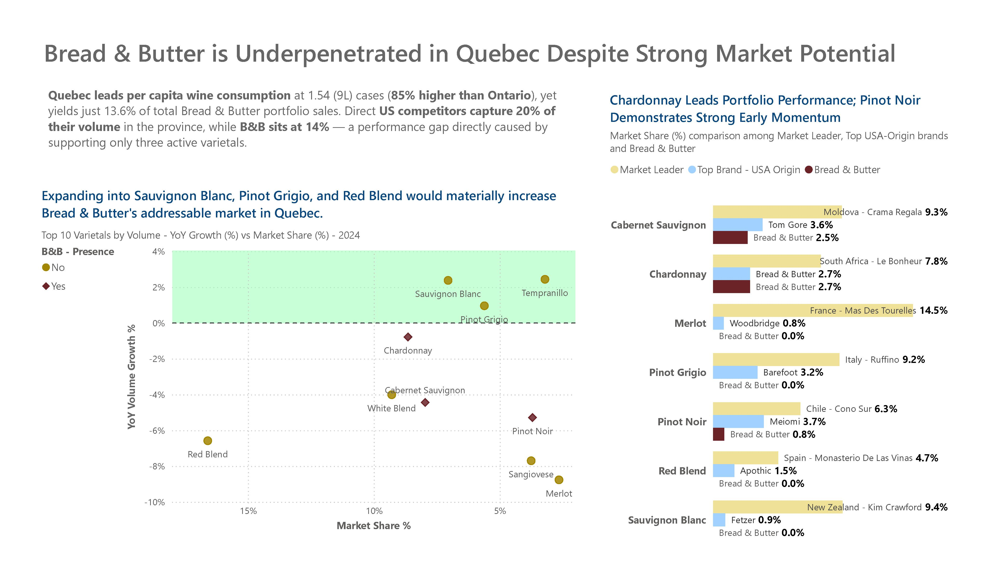
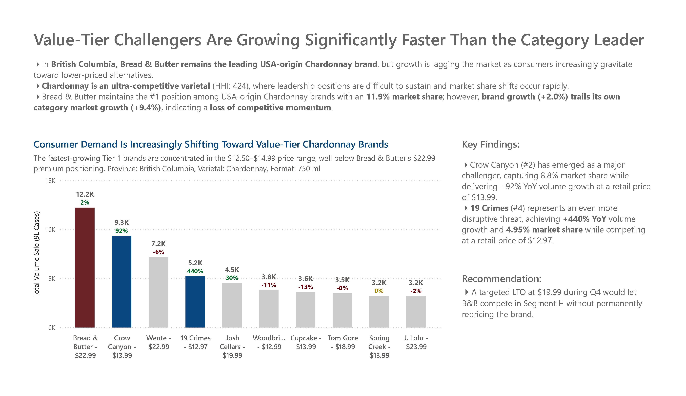
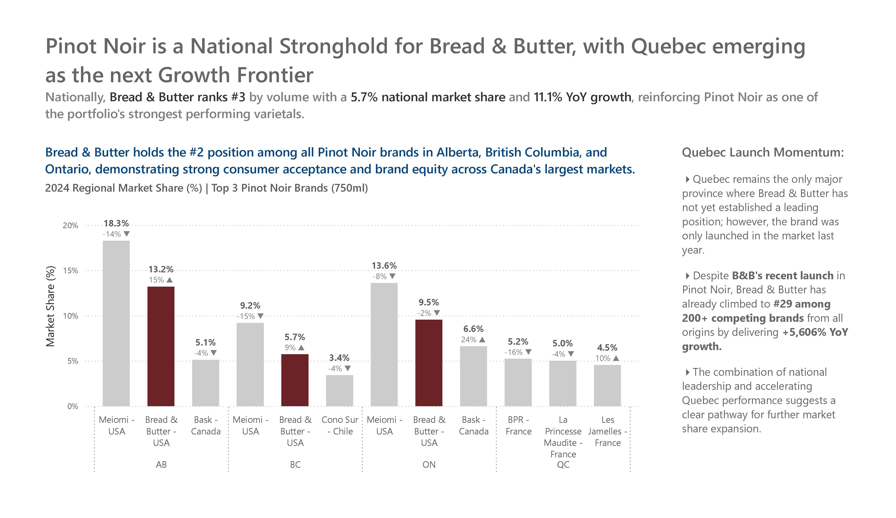
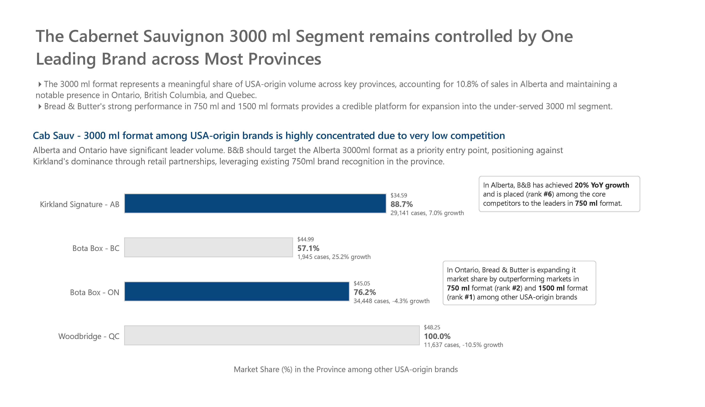

# Bread & Butter Wines: Canadian Market Positioning & Competitive Analysis

> **Client:** WX Brands (Bread & Butter Wines) <br>
> **Delivered via:** George Brown College Capstone Engagement <br>
> **Role:** Team Lead

---

## Overview

This project was delivered as a real client engagement for WX Brands — the global wine portfolio company behind Bread & Butter Wines — through George Brown College's Analytics for Business Decision Making program.

The Canadian wine market contracted by **-3.46% YoY** in 2024, representing a loss of 1.39 million cases. Against this backdrop, Bread & Butter achieved **+27% YoY volume growth**, reaching the **#1 position by volume among all USA-origin wine brands in Canada** — displacing Barefoot after years of market leadership.

This analysis covers competitive performance across four major provinces (Ontario, Quebec, British Columbia, and Alberta), identifies strategic gaps, and delivers data-backed recommendations for market expansion and pricing optimization.

---

## Key Findings

| # | Finding | Implication |
|---|---------|-------------|
| 1 | Quebec has the highest per-capita wine consumption in Canada (1.54 cases/person — 85% above Ontario) yet generates only 13.6% of B&B's national volume | Largest untapped growth opportunity in the portfolio |
| 2 | B&B holds the #1 USA-origin Chardonnay position in BC but grows at +2% while value-tier competitors (19 Crimes: +440%, Crow Canyon: +92%) erode the category from below | Premium positioning under structural threat |
| 3 | B&B ranks #2 in Pinot Noir simultaneously across Alberta, BC, and Ontario — with Meiomi declining in all three markets | Strongest and most defensible national position in the portfolio |
| 4 | Kirkland Signature controls 88.7% of the Cabernet Sauvignon 3000ml format in Alberta — a format representing 10.8% of provincial volume — with no meaningful B&B presence | Immediate format expansion opportunity |

---

## Solution Architecture

```
Raw Excel Data (4 Provinces)
        │
        ▼
Python ETL Pipeline
(OOP design · pandas · IntervalIndex price mapping · melt() normalization)
        │
        ▼
SQL Server Data Warehouse
(Star Schema · Fact + Dimension tables)
        │
        ▼
T-SQL Analytical Models
(6-CTE pipeline · Window Functions · HHI · Concentration Ratios · Strategic Positioning)
        │
        ▼
Power BI Semantic Layer
(Analysis-ready imports only · reduced model complexity)
        │
        ▼
Executive Report + Dashboards
```

---

## Deliverables

### 1. Executive Report — Market Insights & Strategic Recommendations
Five-slide narrative report covering the four key market stories with quantified findings and actionable recommendations. Each story follows a structured argument: market context → competitive data → strategic implication.

📄 [`reports/executive_report.pdf`](reports/executive_report.pdf)

### 2. Python ETL Pipeline
End-to-end data preparation pipeline transforming raw multi-source provincial Excel files into a clean, analysis-ready SQL Server dataset.

**Key engineering challenges solved:**
- AB and BC register sales on a **monthly calendar** while ON and QC use a **13-period fiscal calendar** — a mapping table was engineered to normalize both systems into a consistent seasonal framework before any modelling
- Wide-format period columns transformed to long format using `melt()` for proper dimensional modelling
- `pd.IntervalIndex` used for price-tier segmentation (Segments D through R)
- OOP architecture (`Dir`, `List` helper classes) for maintainable, scalable province handling
- Direct SQL Server ingestion via `pyodbc`

📄 [`python/data_preparation.ipynb`](python/data_preparation.ipynb)


### 3. T-SQL Strategic Positioning Model
A custom two-dimensional analytical framework classifying brand performance across 12 strategic archetypes based on **Market Position** (Leader / Core / Challenger / Niche) and **Growth Momentum** (Expanding / Contracting / Steady).

**Model architecture — 6-CTE analytical pipeline:**

| CTE | Purpose |
|-----|---------|
| `base_table` | Volume and revenue aggregation by brand, varietal, province |
| `market_share_rank_calc` | Market share, cumulative share, and rank via window functions |
| `market_segmentation` | Three-tier volume segmentation (Tier 1/2/3) using `LAG()` boundary logic |
| `market_concentration` | HHI and CR3/CR5/CR10 concentration ratios |
| `market_performance` | YoY change, B&B KPIs, tier-level share shift dynamics |
| `strategic_position_definition` | Final archetype classification and HHI categorisation |

📄 [`sql/market_outlook_report.sql`](sql/market_outlook_report.sql)


### 4. Organic Demand Forecasting Pipeline
A seasonal OLS model with **promotional de-biasing** — forecasting the organic (promotion-free) demand baseline with High / Median / Low uncertainty bands for Power BI integration.

**Why de-biasing matters:** Price promotions drove an average **+155% sales lift** per activated period. Forecasting from raw sales without isolating this effect would embed promotional spikes into the organic baseline, systematically overstating structural demand.

**Model performance:**
- R² : 0.90
- MAPE : 9.9%
- Confidence interval : 90%
- Forecast horizon : 13 periods (1 full year)

📄 [`python/wine_forecast_pipeline.ipynb`](python/wine_forecast_pipeline.ipynb)


### 5. Power BI Dashboards

**Pricing Analysis Dashboard**
Interactive leaderboard of top USA-origin brands by varietal and province — showing volume rank, market share, retail price, price segment, and YoY growth — alongside a price vs. volume scatter and price segment histogram.

**Market Outlook Report**
Varietal-level competitive intelligence per province — HHI concentration index, CR3/CR5 ratios, B&B strategic archetype, and tier-level share shift dynamics.

📄 [`reports/dashboard.pdf`](reports/dashboard.pdf)


---

## Tech Stack

| Layer | Technology |
|-------|-----------|
| Data Source | Multi-source provincial wine sales (Excel — monthly and 13-period fiscal formats) |
| Data Cleaning & Transformation | Python (pandas, NumPy, scikit-learn, statsmodels) |
| Database | SQL Server |
| Data Modelling | Star Schema (Fact + Dimension tables) |
| Analytical Processing | T-SQL (CTEs, Window Functions, HHI, Ranking, Aggregations) |
| Forecasting | OLS Regression with seasonal dummies and promotional de-biasing |
| Business Intelligence | Power BI (DAX, semantic model, interactive dashboards) |
| Reporting | Power BI Executive Report |

---

## Methodology

### Data Preparation
Raw provincial sales data arrived in incompatible formats across four sources. AB and BC reported monthly, ON and QC reported across a 13-period fiscal year beginning in April. A period-mapping table was engineered to unify both calendar systems into a consistent seasonal framework — a prerequisite for any valid cross-provincial comparison.

Data was then cleaned, type-validated, and restructured from wide to long format before ingestion into SQL Server via pyodbc.

### Dimensional Modelling
A star schema was designed around a central sales fact table with supporting dimensions for products, provinces, origin countries, varietals, pricing segments, and calendar periods.

<p align="center">
  
</p>

### Analytical Modelling

**Market Concentration:** The Herfindahl-Hirschman Index (HHI) was calculated per varietal per province to classify market structure (Competitive / Moderately Concentrated / Highly Concentrated). Concentration ratios CR3, CR5, and CR10 complement HHI to characterise competitive dynamics.

**Strategic Positioning:** A proprietary two-dimensional model maps every brand-varietal-province combination to one of 12 performance archetypes using Market Position (volume tier rank) and Growth Momentum (YoY growth vs. market baseline).

**Promotional De-biasing:** An OLS regression model with seasonal dummies and promotional regressors was trained on historical data. Forecasts were generated with all promotional flags set to zero, isolating organic structural demand from lift effects.

### Visualisation Design
The Power BI semantic model imports only analysis-ready datasets produced by T-SQL — reducing model complexity, improving dashboard performance, and separating analytical logic from presentation logic.

---

## Key Business Insights

### Insight 1 — Quebec: Underpenetrated Despite Highest Per-Capita Consumption
<p align="center">
  
</p>
<br>

### Insight 2 — BC Chardonnay: Premium Leadership Under Value-Tier Pressure
<p align="center">
  
</p>
<br>

### Insight 3 — Pinot Noir: B&B's National Stronghold
<p align="center">
  
</p>
<br>

### Insight 4 — Cabernet Sauvignon 3000ml: Concentrated Format, No Competition
<p align="center">
  
</p>
<br>


---

## Recommendations

| Priority | Recommendation | Rationale |
|----------|---------------|-----------|
| 1 | Expand Quebec presence with Sauvignon Blanc, Pinot Grigio, and Red Blend | These are the three highest-volume varietals without B&B presence in the highest per-capita consumption market |
| 2 | Activate End-Aisle Display and Value-Add promotions in BC Chardonnay during Q4 | Display programs drive +25% average lift; protects market share without permanently repricing the brand |
| 3 | Target the Alberta Cabernet Sauvignon 3000ml format through retail partnerships | Kirkland's 88.7% concentration creates a single point of entry; B&B's existing 750ml recognition in AB provides credibility |

---

## Repository Structure

```
bread-butter-wine-analysis/
│
├── data/
│   └── data_dictionary.md          # Field definitions, period calendar mapping
│
├── python/
│   ├── data_preparation.ipynb         # ETL pipeline: raw Excel → SQL Server
│   └── wine_forecast_pipeline.ipynb   # Seasonal OLS forecasting with de-biasing
│
├── sql/
│   ├── market_outlook_report.sql               # 6-CTE strategic positioning model
│   ├── flagship_sku_pricing_analysis.sql       # Price Analysis - Leadership Board
│   └── varietal_performance_benchmarking_and_top_brand_evaluation.sql       # Varietal Performance in Broader markets, Market Leader, leading USA-Origin brand and Bread & Butter performance evaluation
│
│
├── powerbi/
│   └── dashboard.pbix              # Pricing Analysis + Intelligence Board
│
├── reports/
│   ├── executive_report.pdf        # 5-slide executive summary and strategic narrative
│   └── dashboards.pdf              # Dashboard reference export
│
├── images/                         # Architecture diagrams, data model
│
└── README.md
```

---

## Skills Demonstrated

**Technical**
Python (pandas, NumPy, scikit-learn, statsmodels) · T-SQL (CTEs, Window Functions, Ranking, HHI) · Power BI (DAX, Semantic Modelling) · SQL Server · Star Schema Design · ETL Pipeline Development · OLS Regression · Seasonal Decomposition

**Analytical**
Market Concentration Analysis (HHI, CR3/CR5/CR10) · Competitive Intelligence · Strategic Positioning Modelling · Pricing Analysis · Promotional Effectiveness Analysis · Demand Forecasting · Per-Capita Normalisation · Share Shift Dynamics

**Business**
Market Analysis · Competitive Benchmarking · KPI Design · Executive Storytelling · Client Presentation · Strategic Recommendations

---

## About This Project

Originally delivered as an Excel-based capstone engagement for WX Brands through George Brown College in December 2024. Rebuilt and significantly extended over the following 18 months as technical capabilities expanded from Excel to a full Python, SQL Server, and Power BI analytical stack. The version in this repository represents independent work completed after the original engagement

---


